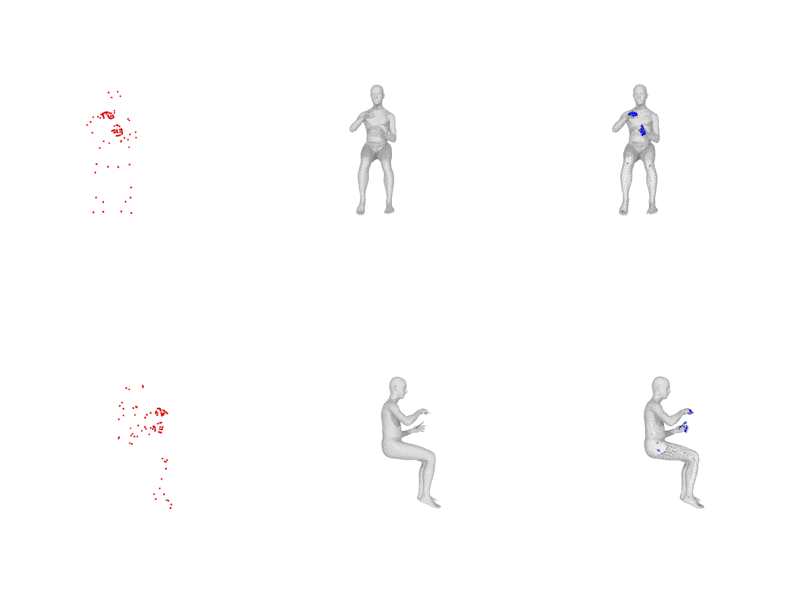

"Columns left-to-right 
[Raw Mocap, Reconstructed Body, Rec. Body with Joints], Each row shouw the same data in different angle.")

We provide several jupyter notebooks to demonstrate how to use AMASS. 
Here is a list of available notebooks:

- [Visualizing The Body Parameters In AMASS](01-AMASS_Visualization.ipynb)
- [AMASS For Deep Learning](02-AMASS_DNN.ipynb)
- [Animating Other Body Models With AMASS](03-AMASS_Visualization_Advanced.ipynb)

## Produce Synthetic MoCaps Using DFaust 4D-Scans
The following is the code snippet to produce your snythetic markers.
You first need to obtain 4D-scan registrations from [DFaust website](http://dfaust.is.tue.mpg.de/downloads).
The code will dump markers at you desired location.

```python
from amass.data.dfaust_synthetic_mocap import registration2markers

registration_dir = 'PATH_TO_DFAUT/REGISTRATION_PKLS'  # download from http://dfaust.is.tue.mpg.de
out_marker_dir = 'OUTPUT_FOR_SYNTHETIC_MOCAP/*.npz'
registration2markers(registration_dir, out_marker_dir)

```